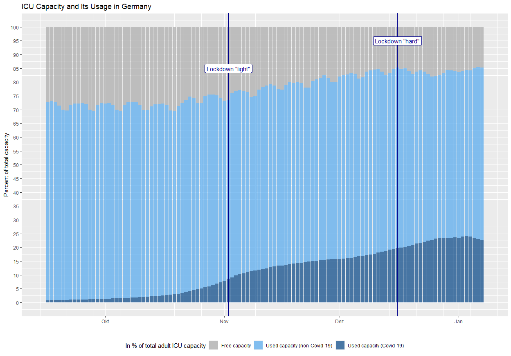

ICU situation in Germany
================

## Capacity usage

The graph shows ICU capacity usage for adult ICU beds in percent of
total capacity. Last reported data is from **January 14th**.

Free capacity is gray, capacity used for non-Covid-19 patients is light
blue and capacity currently in use for the treatment of Covid-19
patients is dark blue.

The vertical blue lines mark the coming into effect of two major
government measures: a partial lockdown on November 2nd (called
*lockdown light* in Germany; essentially restrictions on personal
contacts, closing of restaurants/cafés/bars, except for takeaway, ban on
public events, closing of leisure and sports facilities as well as all
body care related services, except for necessary medical care), and a
tighter lockdown (called *hard lockdown* in Germany; lockdown light plus
closing of all shops except for essential supplies and services, closing
of schools).

Observations:

  - 85.6 % of capacity is currently in use with a 13 pp spread across
    federal states
  - 21.1 % of *total* capacity is currently used for Covid-19 patients
  - 24.6 % of *used* capacity is occupied by Covid-19 patients

## Data sources & code

Data is from the German DIVI intensive care register operated by the
[Robert-Koch-Institut]() (RKI) and the [Deutsche Interdisziplinäre
Vereinigung für Intensiv- und Notfallmedizin](https://www.divi.de/)
(DIVI), and can be obtained from
<https://www.intensivregister.de/#/aktuelle-lage/zeitreihen> (click the
links below the graphics to download the related data). Data and R
source code can be found in this repository.
