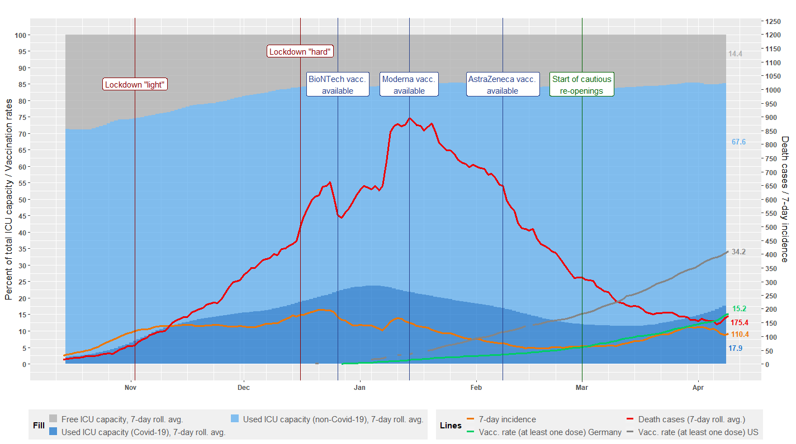

Covid-19 in One Graph
================

### Current Situation in Germany

The graph shows ICU capacity usage for adult ICU beds in percent of
total capacity as well as the 7-day incidence and a 7-day moving average of Covid-19-related death cases. Last reported data is from **February 19th**.

The vertical blue lines mark the coming into effect of two major
government measures: a partial lockdown on November 2nd (called
*lockdown light* in Germany; essentially restrictions on personal
contacts, closing of restaurants/cafés/bars, except for takeaway, ban on
public events, closing of leisure and sports facilities as well as all
body care related services, except for necessary medical care), and a
tighter lockdown (called *hard lockdown* in Germany; lockdown light plus
closing of all shops except for essential supplies and services, closing
of schools).

### Data sources & code

ICU usage data is from the German DIVI intensive care register operated by the
[Robert-Koch-Institut]() (RKI) and the [Deutsche Interdisziplinäre
Vereinigung für Intensiv- und Notfallmedizin](https://www.divi.de/)
(DIVI), and can be obtained from
<https://www.intensivregister.de/#/aktuelle-lage/reports> (click "Zeitreihen-Daten" to download the time series data).
Death cases and 7-day incidence data is taken from the [Robert-Koch-Institut](https://www.rki.de/DE/Content/InfAZ/N/Neuartiges_Coronavirus/Daten/Fallzahlen_Daten.html;jsessionid=FB9800F61AE81ACFF850FB2567F1F1DB.internet071?nn=2386228).

All data (already pre-prepared) and R source code can be found in this repository.