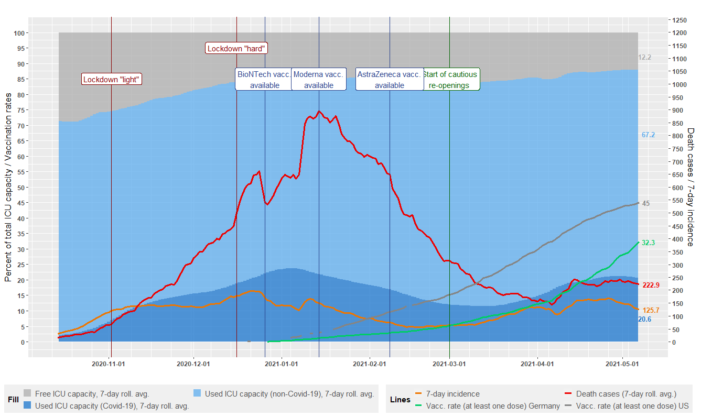

Covid-19 Situation in Germany
================

### Current Situation in One Graph
Last reported data is from **April 9th**.

### Explanations

The vertical dark red lines mark the coming into effect of two major government measures: a partial lockdown on November 2nd (called **lockdown light** in Germany; essentially restrictions on personal contacts, closing of restaurants/cafés/bars, except for takeaway, ban on public events, closing of leisure and sports facilities as well as all body care related services, except for necessary medical care), and a tighter lockdown (called **hard lockdown** in Germany; lockdown light plus closing of all shops except for essential supplies and services, closing of schools).

With effect from March 1st (vertical green line), the German government has decided to take first steps towards a **cautious re-opening** of the economy and the education sector. From March 1st onwards hairdressers may open their shops again; the same applies to schools and child care institutions, depending on decisions on the federal state level. Later during week of March 1st the government decided to allow further re-openings according to a plan stipulating five opening phases the first of which is considered to be the March 1st opening of hairdressers and schools. Phases according to the plan will be take effect locally on the county level, depending on the 7-day-incidence rate of the county. Details are available from the [federal government](https://www.bundesregierung.de/breg-de/themen/coronavirus/fuenf-oeffnungsschritte-1872120)

### Data sources & code

* **ICU usage data**:  DIVI intensive care register operated by the [Robert-Koch-Institut]() (RKI) and the [Deutsche Interdisziplinäre
Vereinigung für Intensiv- und Notfallmedizin](https://www.divi.de/); data can be downloaded from <https://www.intensivregister.de/#/aktuelle-lage/reports> (click "Zeitreihen-Daten" to download the time series data).
* **Death cases** and **7-day incidence data**: [Robert-Koch-Institut](https://www.rki.de/DE/Content/InfAZ/N/Neuartiges_Coronavirus/Daten/Fallzahlen_Daten.html;jsessionid=FB9800F61AE81ACFF850FB2567F1F1DB.internet071?nn=2386228).
* **Vaccination rate** for **Germany**: [Vaccination dashboard of the German Government](https://impfdashboard.de/daten)
* **Vaccination rate data** for the **United States**: [Our World in Data](https://ourworldindata.org/covid-vaccinations?country=~USA)
* **Dates of market availability of vaccines in Germany**: [Robert-Koch-Institut](https://www.rki.de/DE/Content/InfAZ/N/Neuartiges_Coronavirus/Daten/Impfquotenmonitoring.xlsx?__blob=publicationFile)
* **Population number Germany**: [Federal Statistical Office of Germany](https://www.destatis.de/DE/Themen/Gesellschaft-Umwelt/Bevoelkerung/Bevoelkerungsstand/Tabellen/zensus-geschlecht-staatsangehoerigkeit-2020.html)

All data (already pre-prepared) and R source code can be found in this repository.
